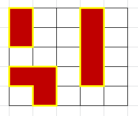
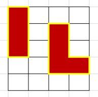

# Land Perimeter

## Description

Given an array arr of strings complete the function landPerimeter by calculating the total perimeter of all the islands. Each piece of land will be marked with 'X' while the water fields are represented as 'O'. Consider each tile being a perfect 1 x 1 piece of land. Some examples for better visualization:

```js
["XOOXO", "XOOXO", "OOOXO", "XXOXO", "OXOOO"];
```

which represents:



should return: "Total land perimeter: 24".

Following input:

```js
["XOOO", "XOXO", "XOXO", "OOXX", "OOOO"];
```

which represents:



should return: "Total land perimeter: 18"
